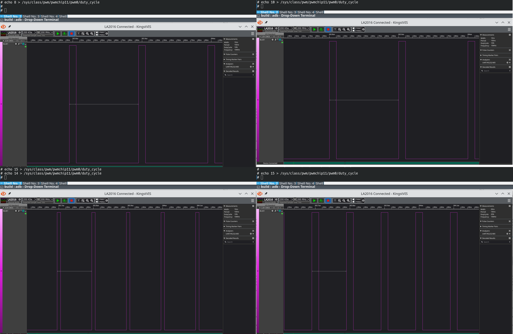

# Testing Luckfox Pico RISC-V boards.
* [WIKI](https://wiki.luckfox.com/Luckfox-Pico/Luckfox-Pico-quick-start/)
* [SDK](https://github.com/LuckfoxTECH/luckfox-pico)

## RV1103
### PWM
#### Resolution
Even if the unit is a nanosecond, apparently the minimum resolution of the provided firmware kernel (Linux luckfox 5.10.110) is 10ns: 

#### Jitter
It seems to have a jitter of ~5-10ns:

