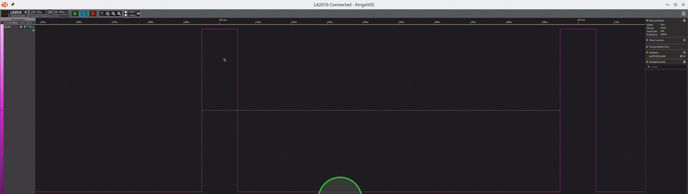

# Testing Luckfox Pico RISC-V boards.
* [WIKI](https://wiki.luckfox.com/Luckfox-Pico/Luckfox-Pico-quick-start/)
* [SDK](https://github.com/LuckfoxTECH/luckfox-pico)

## Cross-compiling with cmake
Following instructions in [https://wiki.luckfox.com/Luckfox-Pico/Core3566-SDK/](https://wiki.luckfox.com/Luckfox-Pico/Core3566-SDK/), using docker image ```luckfoxtech/luckfox_pico:1.0``` with the [SDK](https://github.com/LuckfoxTECH/luckfox-pico) mounted in the container in ```/home```.


### Tests programs
See examples in [test_programs folder](test_programs/).

Compiled binaries published in [gitlab actions](https://github.com/naelolaiz/luckfox_rockchip_testing/actions/) jobs.

## RV1103
### PWM
#### Resolution
Even if the unit is a nanosecond, apparently the minimum resolution of the provided firmware kernel (Linux luckfox 5.10.110) is 10ns: 


#### Jitter
It seems to have a jitter of ~5-10ns:


#### Stability
There are gaps up to ~70us on the PWM output when using small duty cycles (~10ns):


This does not seem to happen when increasing the duty cycle to >20ns.
