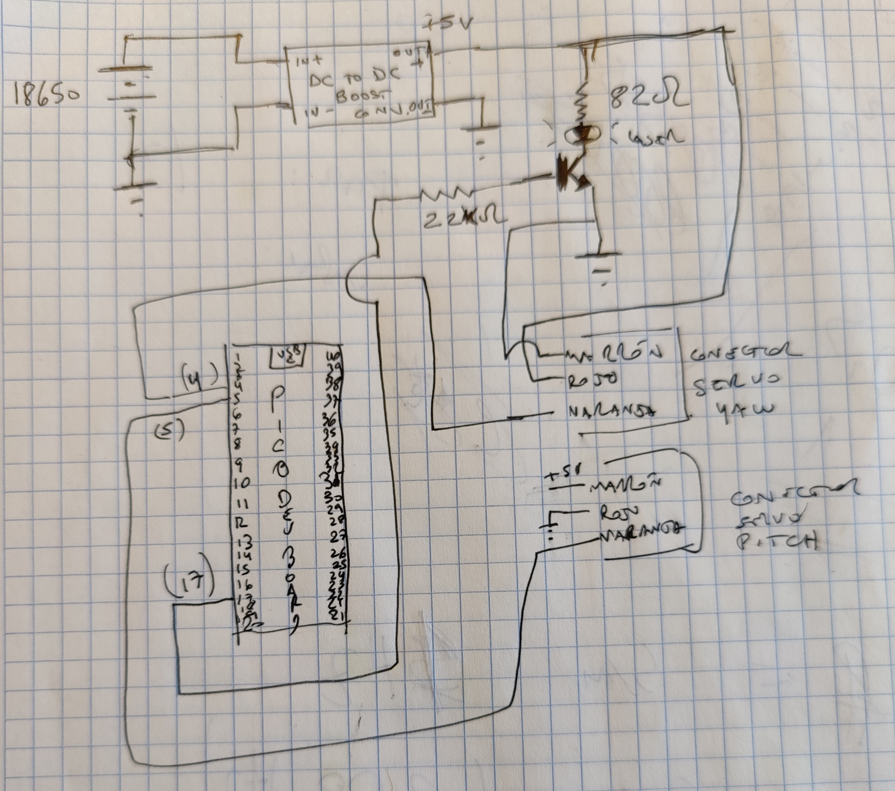

# Lissajous projections with two servos and a LASER pointer LED

## servos
https://www.handsontec.com/dataspecs/motor_fan/MG996R.pdf

## servos cases
https://www.thingiverse.com/thing:3458238

## LED pointer
https://www.katranji.com/tocimages/files/336817-121153.pdf

## Circuit diagram

## use examples
### "Hearth" 
./pwm_two_servos --sleepMs 3 --updateStep 0.05 --servoYawFreq 1 --servoPitchFre
q 1 --servoPitchIP 0.25 --servoYawIP 0.0 --servoYawMaxValInNs 1000000 --servoYaw
MinValInNs 500000 --servoPitchMaxValInNs 1900000 --servoPitchMinValInNs 1300000 
   --enableLaser 4 --spiral 2

### Lisajjous
./pwm_two_servos --sleepMs 3 --updateStep 0.05 --servoYawFreq 1 --servoPitchFre
q 2 --servoPitchIP 0.0 --servoYawIP 0.0 --servoYawMaxValInNs 1000000 --servoYawM
inValInNs 500000 --servoPitchMaxValInNs 1900000 --servoPitchMinValInNs 1300000  
  --enableLaser 4 --spiral 6

### infinity

./pwm_two_servos --sleepMs 1 --updateStep 0.03 --servoYawFreq 1 --servoPitchFre
q 2 --servoPitchIP 0.0 --servoYawIP 0.25 --servoYawMaxValInNs 850000 --servoYawM
inValInNs 650000 --servoPitchMaxValInNs 1600000 --servoPitchMinValInNs 1400000
  --enableLaser 4 --spiral 20

